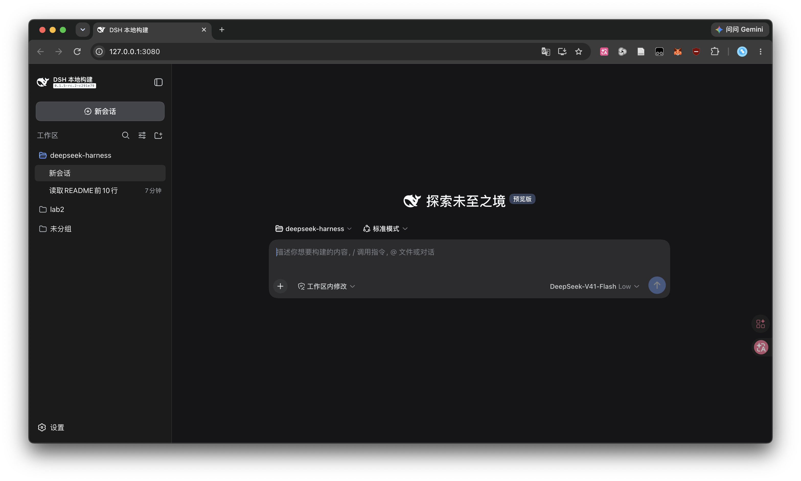
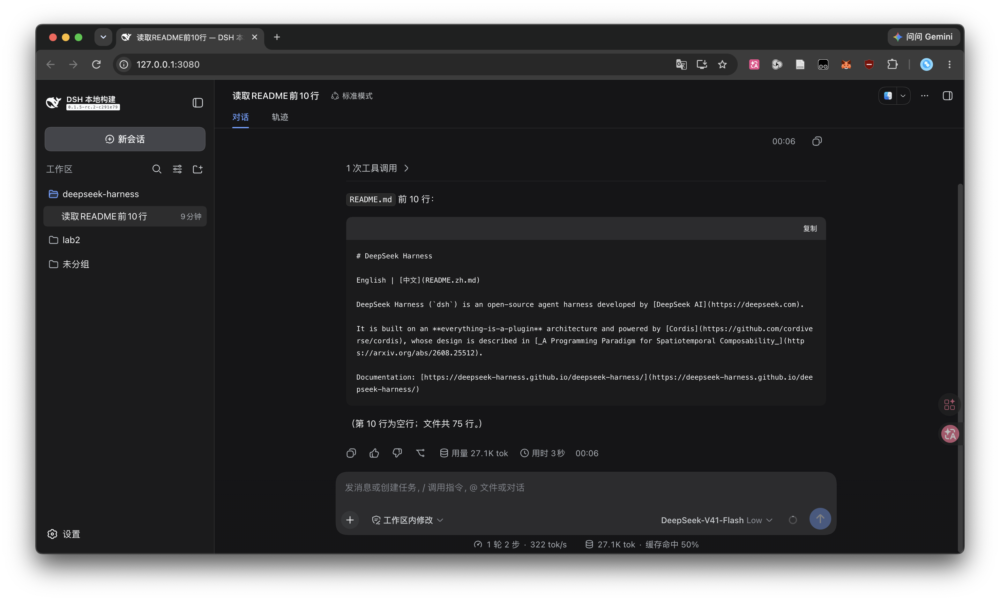
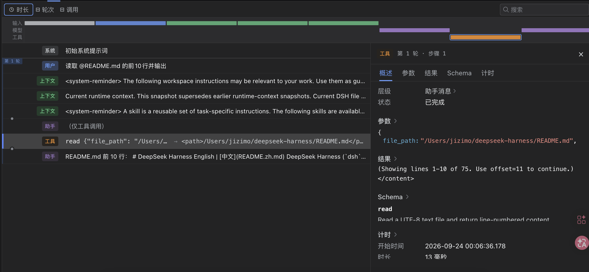
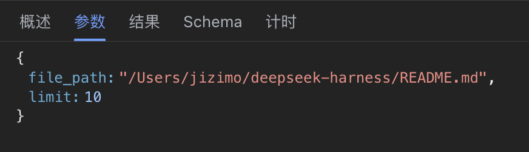

# 0 前言

上个月 DeepSeek 发布了 DeepSeek Harness 这个 AI Agent 框架，之前忙保研来不及捣鼓这个东西，九月忙得差不多了，正好趁着 DeepSeek 降价来研究一下。

# 1 环境配置

直接参考 [DeepSeek Harness 官方文档](https://github.com/deepseek-ai/deepseek-harness/blob/master/README.zh.md#run)，如果只是想用 Web UI，直接

```shell
npx @deepseek-ai/dsh web
```

即可，想要更大的自由度，则从源码安装

```shell
git clone https://github.com/deepseek-ai/deepseek-harness.git
cd deepseek-harness
pnpm install
pnpm run build
pnpm dsh web
```

非常简单。

# 2 基础使用

DeepSeek Harness 作为一个基础框架，提供了一些基本的预设，可以通过 `--profile` 来指定

| Profile       | 用途                                                        | 大致组成                |
| ------------- | ----------------------------------------------------------- | ----------------------- |
| `web`         | **网页交互模式**，普通用户最容易直接使用                    | `base + web-app`        |
| `headless`    | **一次性 CLI Agent 任务**，适合脚本/自动化                  | `base + headless`       |
| `sdk`         | **完整 SDK 模式**，给 Python/TS 等程序调用                  | `base + sdk-app`        |
| `sdk-minimal` | **极简 SDK 模式**，只保留很少的 Agent 能力                  | 独立配置，不使用 `base` |
| `acp`         | **ACP 协议模式**，给支持 Agent Client Protocol 的客户端连接 | `base + acp-app`        |

# 3 插件

DeepSeek Harness 自称为 _everything-is-a-plugin_，其本质上就是由插件组装出来的 _Agent Harness_，为开发者提供了极高的自由度。

下面研究一下 DeepSeek Harness 中的代码

## 3.1 `read.ts`

DeepSeek Harness 官方就提供了一些预设好的 plugin，我们以最基础的阅读文件工具 [`read.ts`](https://github.com/deepseek-ai/deepseek-harness/blob/master/packages/fs/tool-fs/src/read.ts) 看起。

这个工具整体代码不是特别复杂，200多行代码，其核心入口位于

```typescript
export function applyReadTool(ctx: Context, caps: ReadToolCaps): void;
```

主要是通过

```typescript
ctx.tools.register(defineTool({...}))
```

这个入口来注册工具。`defineTool`定义工具的时候有下列的这些字段：

| 键                  | 官方语义                                                    |
| ------------------- | ----------------------------------------------------------- |
| `name`              | 工具名，模型调用时使用                                      |
| `description`       | 给模型看的工具说明                                          |
| `parameters`        | 输入参数定义，`defineTool` 会据此做类型推断和参数校验       |
| `output`            | 声明规范输出；通常包含 `schema` 和 `render`                 |
| `execute`           | 实际执行函数，返回 `output.schema` 所声明的 canonical value |
| `isConcurrencySafe` | 声明该工具是否可安全并发执行                                |
| `presentCall`       | 可选 UI 展示：工具调用发生时怎么显示                        |
| `presentResult`     | 可选 UI 展示：工具执行结果怎么显示                          |

详细的描述在[tools.md](https://github.com/deepseek-ai/deepseek-harness/blob/master/docs/subsystems/tools.md)中。

这里比较难理解的或许就是 `output` 了，他其实由两部分组成，一部分是 `schema`，它定义了 `execute` 实际执行后返回的对象结构，这个同时也是 `render` 这个函数接受的参数对象结构。`output` 相当于在 `execute` 这个函数的后面接一个结构化输出（JS/TS Object）到自然语言（字符串）的一个处理器。比如 read 工具的 `execute` 可能返回：

```
{
  path: "/a.ts",
  offset: 10,
  lines: [
    { number: 10, text: "const x = 1" }
  ],
  totalLines: 100
}
```

经过 `output` 这部分处理后，会产生类似：

```
<path>/a.ts</path>
<type>file</type>
<content>
10: const x = 1
</content>
```

这样的结果。当然，如果 `execute` 因为某些原因没有输出schema规定的结构，就会产生报错。

## 3.2 调用 `read` 工具

下面以一个实例来观察read工具如何被调用，这里假设我们已经根据Deepseek Harness的指导完成了环境的基本配置并且能使用web ui



我们用一个非常简单的 “读取 README.md 的前10行并输出“ 这个任务，来测试一下 `read` 工具的调用，输入一段要求读取前十行的提示词：



可以看到，deepseek忠实地按照我们的指令完成了任务。

那么我们怎么确定，这里的内容是用了 `read` 工具，还是调用了其他工具，还是deepseek幻觉产生的呢？事实上，deepseek harness的web ui profile提供了一个很好用的功能让我们查看模型调用工具，处理提示词的完整流程。在标题下方的标签栏选择 “轨迹”，可以看到一个非常类似浏览器中的开发者工具的控制台，这就是默认加载的 `dsh-client-ui-trajectory`。这个地方的时间轴分成了输入-模型-工具三列，输入即我们的提示词（包括系统提示词等），模型是deepseek的生成过程，工具则是我们的模型调用工具的记录，我们选中某一段即可看到某次调用的详细信息：



这里我们可以看到，deepseek确实是调用了read工具来完成这里的读取任务。如果阅读过 `read.ts` 这里的源代码，我们就能知道，这个工具的参数被定义为：

```typescript
    parameters: {
      file_path: { type: 'string', required: true, description: 'Path to read, resolved by the filesystem backend.' },
      offset: { type: 'number', description: '1-based first line to return. Defaults to 1.' },
      limit: { type: 'number', description: `Maximum number of lines to return. Defaults to ${caps.limit}.` },
    },
```

切到参数一栏，可以看到和这里的参数能够对应上：



接下来看工具调用的结果，我这里的结果是这样的：

```
<path>/Users/jizimo/deepseek-harness/README.md</path>
<type>file</type>
<content>
1: # DeepSeek Harness
2:
3: English | [中文](README.zh.md)
4:
5: DeepSeek Harness (`dsh`) is an open-source agent harness developed by [DeepSeek AI](https://deepseek.com).
6:
7: It is built on an **everything-is-a-plugin** architecture and powered by [Cordis](https://github.com/cordiverse/cordis), whose design is described in [_A Programming Paradigm for Spatiotemporal Composability_](https://arxiv.org/abs/2608.25512).
8:
9: Documentation: [https://deepseek-harness.github.io/deepseek-harness/](https://deepseek-harness.github.io/deepseek-harness/)
10:

(Showing lines 1-10 of 75. Use offset=11 to continue.)
</content>
```

可以看出来，这里的结果看起来和 `execute` 返回的 `outcome` 对象差不多，但是又似乎不太一样：

```typescript
    async execute(args, exec) {
      const input = parseReadArgs(args, caps.limit)
      // One stat: absence observation OR type check + size routing + present version.
      // A concurrent write can only make a later guarded mutation fail stale and require reread.
      const { target, info } = await resolveRegularReadTarget(ctx, exec, input.filePath)

      // Stream when the file is large OR size is unknown, so a size-less backend
      // never buffers an arbitrarily large file.
      const chunks = info.size === undefined || info.size >= caps.streamMinSize
        ? await ctx.fs.streamText(target, exec.signal)
        : [await ctx.fs.readText(target, exec.signal)]
      const window = await buildWindow(
        chunks,
        { offset: input.offset, limit: input.limit, maxLineLength: caps.maxLineLength, maxBytes: caps.maxBytes },
        target.displayPath,
      )

      const outcome = {
        path: target.displayPath,
        offset: input.offset,
        lines: window.lines,
        totalLines: window.totalLines,
      }
      // Record the present observation (a no-op when no policy plugin listens). The
      // read already succeeded; an fs/observed listener is contractually a
      // synchronous, side-effect-only recorder.
      ctx.emit('fs/observed', target, { kind: 'present', version: info.version }, exec)
      return outcome
    },
```

输出中的各个标签都能和 `outcome` 中的字段对应起来，但是为什么不直接以对象形式展示出来呢？另外，`<content>` 标签内的 `(Showing lines 1-10 of 75. Use offset=11 to continue.)` 又是从何而来？这就是我们之前提到的 `render` 函数发挥作用的结果了

```typescript
      render: (args, value) => {
        const input = parseReadArgs(args, caps.limit)
        const endLine = value.lines.at(-1)?.number ?? Math.max(0, value.offset - 1)
        const truncatedByBytes = value.lines.length < input.limit && endLine < value.totalLines
        return [{
          type: 'text',
          text: formatReadOutput(value.path, {
            offset: value.offset,
            lines: value.lines,
            totalLines: value.totalLines,
            ...truncatedByBytes ? { truncatedByBytes: true } : {},
          }),
        }]
      },
```

这里，函数调用的 `formatReadOutput` 会把 `outcome` 对象给格式化成我们看到的结果形式。

# 4 总结

这篇文章大致介绍了一下 DeepSeek Harness 的安装和使用方法。同时我也尝试以一个简单的 `read` 工具作为切入点，简单分析了 DeepSeek Harness 中的插件系统，如果有不足之处敬请多多指教！
